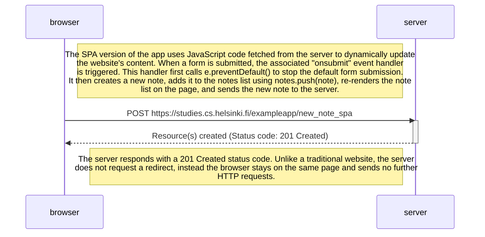

```mermaid
    sequenceDiagram
        participant browser
        participant server
    
        Note right of browser: The SPA version of the app uses JavaScript code fetched from the server to dynamically update<br> the website's content. When a form is submitted, the associated "onsubmit" event handler<br> is triggered. This handler first calls e.preventDefault() to stop the default form submission.<br> It then creates a new note, adds it to the notes list using notes.push(note), re-renders the note<br> list on the page, and sends the new note to the server.

        browser->>server: POST https://studies.cs.helsinki.fi/exampleapp/new_note_spa
        activate server
        server-->>browser: Resource(s) created (Status code: 201 Created)
        deactivate server

        Note left of server: The server responds with a 201 Created status code. Unlike a traditional website, the server<br> does not request a redirect, instead the browser stays on the same page and sends no further<br> HTTP requests.
```